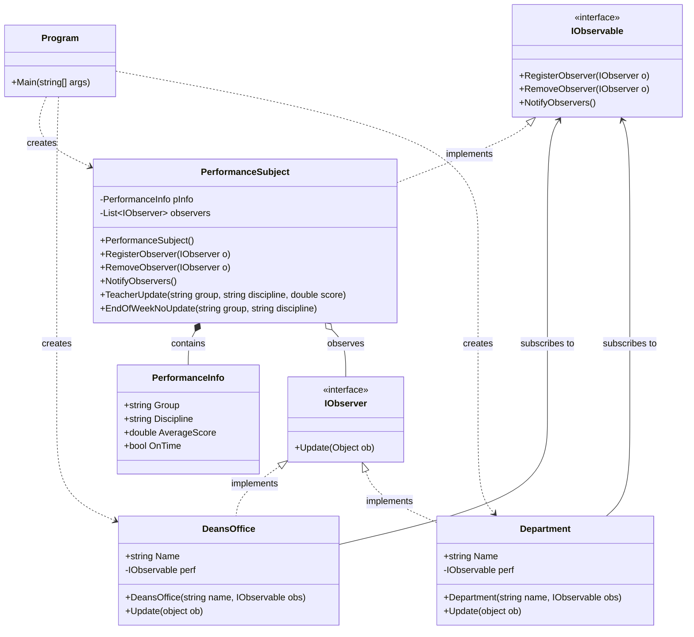
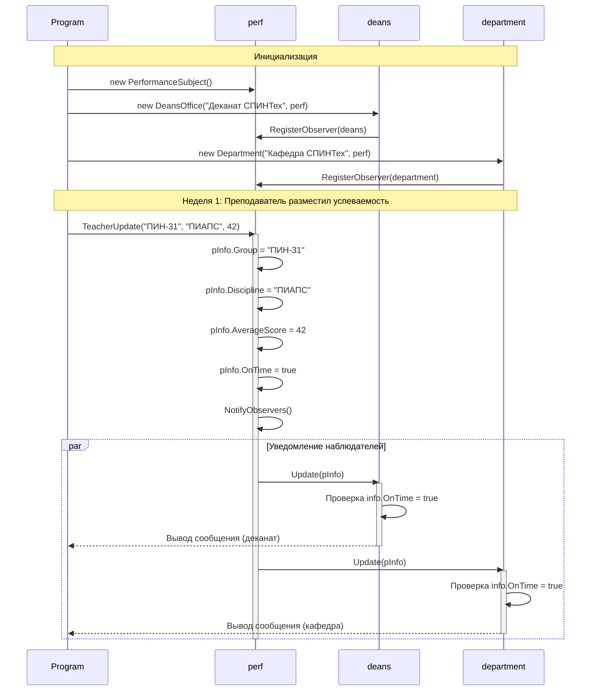
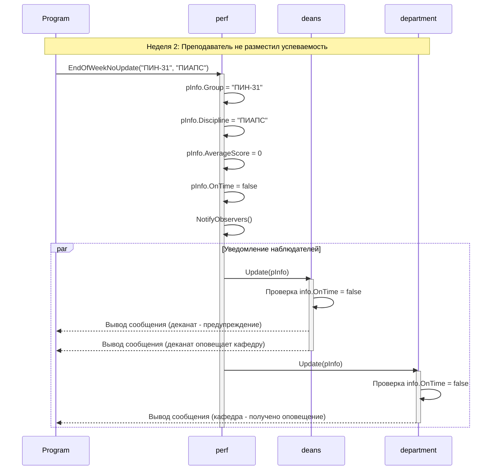

# Диаграммы карочи

## Диаграмма классов

```mermaid
classDiagram
    class IObservable {
        <<interface>>
        +RegisterObserver(IObserver o)
        +RemoveObserver(IObserver o)
        +NotifyObservers()
    }
    
    class IObserver {
        <<interface>>
        +Update(Object ob)
    }
    
    class PerformanceSubject {
        -PerformanceInfo pInfo
        -List~IObserver~ observers
        +PerformanceSubject()
        +RegisterObserver(IObserver o)
        +RemoveObserver(IObserver o)
        +NotifyObservers()
        +TeacherUpdate(string group, string discipline, double score)
        +EndOfWeekNoUpdate(string group, string discipline)
    }
    
    class PerformanceInfo {
        +string Group
        +string Discipline
        +double AverageScore
        +bool OnTime
    }
    
    class DeansOffice {
        +string Name
        -IObservable perf
        +DeansOffice(string name, IObservable obs)
        +Update(object ob)
    }
    
    class Department {
        +string Name
        -IObservable perf
        +Department(string name, IObservable obs)
        +Update(object ob)
    }
    
    class Program {
        +Main(string[] args)
    }
    
    IObservable <|.. PerformanceSubject : implements
    IObserver <|.. DeansOffice : implements
    IObserver <|.. Department : implements
    
    PerformanceSubject *-- PerformanceInfo : contains
    PerformanceSubject o-- IObserver : observes
    
    DeansOffice --> IObservable : subscribes to
    Department --> IObservable : subscribes to
    
    Program ..> PerformanceSubject : creates
    Program ..> DeansOffice : creates
    Program ..> Department : creates
```

## Диаграмма последовательности

### Для TeacherUpdate

```mermaid
sequenceDiagram
    participant Program
    participant PerformanceSubject as perf
    participant DeansOffice as deans
    participant Department as department
    
    Note over Program,Department: Инициализация
    Program->>PerformanceSubject: new PerformanceSubject()
    Program->>DeansOffice: new DeansOffice("Деканат СПИНТех", perf)
    DeansOffice->>PerformanceSubject: RegisterObserver(deans)
    Program->>Department: new Department("Кафедра СПИНТех", perf)
    Department->>PerformanceSubject: RegisterObserver(department)
    
    Note over Program,Department: Неделя 1: Преподаватель разместил успеваемость
    Program->>PerformanceSubject: TeacherUpdate("ПИН-31", "ПИАПС", 42)
    activate PerformanceSubject
    PerformanceSubject->>PerformanceSubject: pInfo.Group = "ПИН-31"
    PerformanceSubject->>PerformanceSubject: pInfo.Discipline = "ПИАПС"
    PerformanceSubject->>PerformanceSubject: pInfo.AverageScore = 42
    PerformanceSubject->>PerformanceSubject: pInfo.OnTime = true
    PerformanceSubject->>PerformanceSubject: NotifyObservers()
    
    par Уведомление наблюдателей
        PerformanceSubject->>DeansOffice: Update(pInfo)
        activate DeansOffice
        DeansOffice->>DeansOffice: Проверка info.OnTime = true
        DeansOffice-->>Program: Вывод сообщения (деканат)
        deactivate DeansOffice
        
        PerformanceSubject->>Department: Update(pInfo)
        activate Department
        Department->>Department: Проверка info.OnTime = true
        Department-->>Program: Вывод сообщения (кафедра)
        deactivate Department
    end
    deactivate PerformanceSubject
```

### Для EndOfWeekNoUpdate

```mermaid
sequenceDiagram
    participant Program
    participant PerformanceSubject as perf
    participant DeansOffice as deans
    participant Department as department
    
    Note over Program,Department: Неделя 2: Преподаватель не разместил успеваемость
    Program->>PerformanceSubject: EndOfWeekNoUpdate("ПИН-31", "ПИАПС")
    activate PerformanceSubject
    PerformanceSubject->>PerformanceSubject: pInfo.Group = "ПИН-31"
    PerformanceSubject->>PerformanceSubject: pInfo.Discipline = "ПИАПС"
    PerformanceSubject->>PerformanceSubject: pInfo.AverageScore = 0
    PerformanceSubject->>PerformanceSubject: pInfo.OnTime = false
    PerformanceSubject->>PerformanceSubject: NotifyObservers()
    
    par Уведомление наблюдателей
        PerformanceSubject->>DeansOffice: Update(pInfo)
        activate DeansOffice
        DeansOffice->>DeansOffice: Проверка info.OnTime = false
        DeansOffice-->>Program: Вывод сообщения (деканат - предупреждение)
        DeansOffice-->>Program: Вывод сообщения (деканат оповещает кафедру)
        deactivate DeansOffice
        
        PerformanceSubject->>Department: Update(pInfo)
        activate Department
        Department->>Department: Проверка info.OnTime = false
        Department-->>Program: Вывод сообщения (кафедра - получено оповещение)
        deactivate Department
    end
    deactivate PerformanceSubject
```
